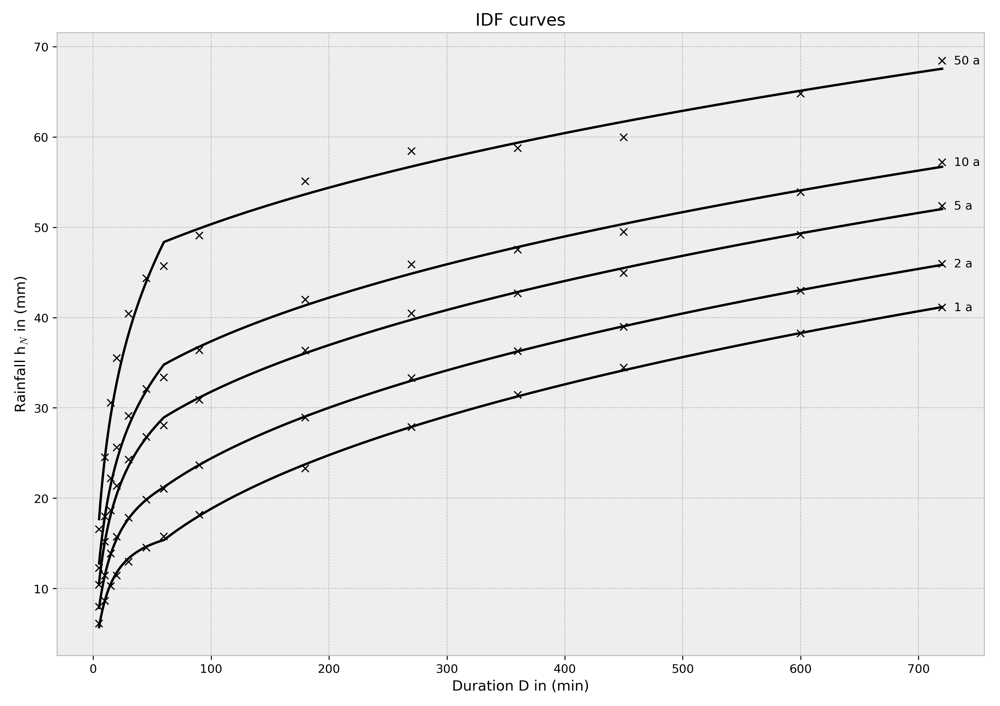

© [Institute of Urban Water Management and Landscape Water Engineering](https://www.tugraz.at), [Graz University of Technology](https://www.tugraz.at/home/) and [Markus Pichler](mailto:markus.pichler@tugraz.at)


# Intensity duration frequency analysis (based on KOSTRA)
heavy rain as a function of the duration and the return period acc. to [DWA-A 531 (2012)](http://www.dwa.de/dwa/shop/shop.nsf/Produktanzeige?openform&produktid=P-DWAA-8XMUY2)
This program reads the measurement data of the rainfall
and calculates the distribution of the rainfall as a function of the return period and the duration
for duration steps up to 12 hours (and more) and return period in a range of '0.5a &lt;= T_n &lt;= 100a'

# Install

See the python packages requirements in the 'requirements.txt'. (those packages will get installed during the installing process)

To install the packages via github, [git](https://git-scm.com/) must be installed first.

Otherwise download the package manually via your browser and replace git+xxx.git with the path to the unzipped folder.

I recommend to use Anaconda to install python on Windows and the [Anaconda](https://www.anaconda.com/download/) Prompt for the commandline tool.

## Fresh install

The script is written in Python3.

```
pip install git+https://github.com/MarkusPic/intensity_duration_frequency_analysis.git
```

To install the package only for the local user account, add ```--user``` to the install command.

## Update package

To update the package, add ```--upgrade``` to the install command.

```
pip install git+https://github.com/MarkusPic/intensity_duration_frequency_analysis.git --upgrade
```

## Install without git

First download the package as a [zip-file](https://codeload.github.com/MarkusPic/intensity_duration_frequency_analysis/zip/master).

Then unzip the folder.

Now you can install the package with the local files

```
pip install <PATH_TO_FOLDER>\intensity_duration_frequency_analysis-master
```

# Usage

To start the script use following commands in the terminal/Anaconda Prompt

Windows:
```python -m idf_analysis```

Unix-Like:
```idf_analysis```

# Commandline tool 

> ```idf_analysis -h```

```
usage: idf_analysis [-h] -i INPUT [-out OUTPUT] [-t {>= 0.5 a and <= 100 a}]
                    [-d {>= 5 min and <= 720 min}] [-h_N {>= 0 mm}]
                    [-ws {ATV-A_121,DWA-A_531,DWA-A_531_advektiv}]
                    [-kind {partial,annual}] [--r_720_1] [--plot]
                    [--extended_duration] [--export_table] [--unix]

optional arguments:
  -h, --help            show this help message and exit
  -i INPUT, --input INPUT
                        input file with the rain time series
  -out OUTPUT, --output OUTPUT
                        output path, where to write the results / default:
                        same as input
  -t {>= 0.5 a and <= 100 a}, --return_period {>= 0.5 a and <= 100 a}
                        return period in years (If two of the three variables
                        (rainfall, duration, return period) are given, the
                        third variable is calculated.)
  -d {>= 5 min and <= 720 min}, --duration {>= 5 min and <= 720 min}
                        duration in minutes (If two of the three variables
                        (rainfall, duration, return period) are given, the
                        third variable is calculated.)
  -h_N {>= 0 mm}, --height_of_rainfall {>= 0 mm}
                        rainfall in mm or Liter/m^2 (If two of the three
                        variables (rainfall, duration, return period) are
                        given, the third variable is calculated.)
  -ws {ATV-A_121,DWA-A_531,DWA-A_531_advektiv}, --worksheet {ATV-A_121,DWA-A_531,DWA-A_531_advektiv}
                        Worksheet used to calculate.
  -kind {partial,annual}, --series_kind {partial,annual}
                        The kind of series used for the calculation.
                        Calculation with partial series is more precise
  --r_720_1             design rainfall with a duration of 720 minutes (=12h)
                        and a return period of 1 day
  --plot                get a plot of the idf relationship
  --extended_duration   add [720, 1080, 1440, 2880, 4320, 5760, 7200, 8640]
                        (in minutes) to the duration steps which will be
                        calculated
  --export_table        get a table of the most frequent used values
  --unix                export the csv files with a "," as separator and a "."
                        as decimal sign.
```

# Example




## Result table

|    |     0.5   |     1.0   |     2.0   |     3.0   |     5.0   |     10.0  |     15.0  |     50.0  |     100.0|
|----|-----------|-----------|-----------|-----------|-----------|-----------|-----------|-----------|----------|
|5   |  2.896502 |  4.531663 |  6.166823 |  7.123331 |  8.328387 |  9.963548 | 10.920055 | 13.760272 | 15.395433|
|10  |  5.309142 |  7.519352 |  9.729563 | 11.022454 | 12.651303 | 14.861514 | 16.154404 | 19.993464 | 22.203675|
|15  |  7.001011 |  9.637280 | 12.273549 | 13.815667 | 15.758507 | 18.394775 | 19.936894 | 24.516002 | 27.152271|
|20  |  8.229495 | 11.216989 | 14.204483 | 15.952055 | 18.153735 | 21.141229 | 22.888801 | 28.077975 | 31.065469|
|30  |  9.852722 | 13.416110 | 16.979497 | 19.063945 | 21.690039 | 25.253426 | 27.337874 | 33.527355 | 37.090743|
|45  | 11.182970 | 15.433265 | 19.683560 | 22.169823 | 25.302143 | 29.552438 | 32.038701 | 39.421316 | 43.671611|
|60  | 11.871244 | 16.687797 | 21.504351 | 24.321854 | 27.871488 | 32.688041 | 35.505544 | 43.871732 | 48.688285|
|90  | 13.636861 | 18.657189 | 23.677518 | 26.614222 | 30.314031 | 35.334359 | 38.271063 | 46.991201 | 52.011529|
|180 | 17.188203 | 22.577053 | 27.965902 | 31.118177 | 35.089574 | 40.478424 | 43.630698 | 52.990945 | 58.379794|
|270 | 19.624622 | 25.241459 | 30.858296 | 34.143934 | 38.283350 | 43.900187 | 47.185826 | 56.942078 | 62.558915|
|360 | 21.536055 | 27.320477 | 33.104900 | 36.488570 | 40.751490 | 46.535912 | 49.919582 | 59.966925 | 65.751347|
|450 | 23.132458 | 29.050305 | 34.968153 | 38.429872 | 42.791122 | 48.708969 | 52.170688 | 62.449785 | 68.367633|
|600 | 25.348627 | 31.443040 | 37.537454 | 41.102458 | 45.593832 | 51.688245 | 55.253249 | 65.839037 | 71.933450|
|720 | 26.851460 | 33.060492 | 39.269525 | 42.901576 | 47.477419 | 53.686451 | 57.318502 | 68.103378 | 74.312410|
