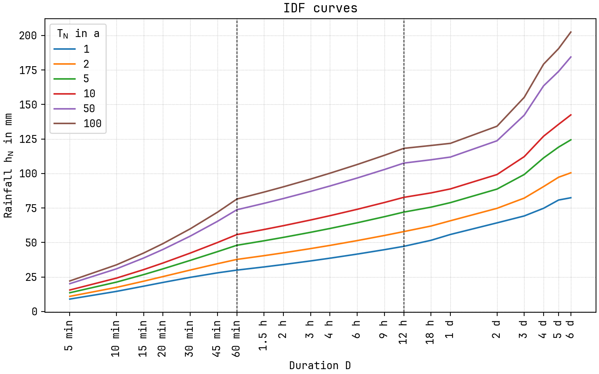

© [Institute of Urban Water Management and Landscape Water Engineering](https://www.sww.tugraz.at), [Graz University of Technology](https://www.tugraz.at/home/) and [Markus Pichler](mailto:markus.pichler@tugraz.at)


# Intensity duration frequency analysis (based on KOSTRA)


[](https://github.com/MarkusPic/intensity_duration_frequency_analysis/blob/master/LICENSE)
[](https://pypi.python.org/pypi/idf-analysis)
[](https://gitter.im/MarkusPic/intensity_duration_frequency_analysis?utm_source=badge&utm_medium=badge&utm_campaign=pr-badge&utm_content=badge)

[](https://pypi.python.org/pypi/idf-analysis)
[](https://pypi.python.org/pypi/idf-analysis)
[](https://pypi.python.org/pypi/idf-analysis)


Heavy rain as a function of the duration and the return period acc. to [DWA-A 531 (2012)](http://www.dwa.de/dwa/shop/shop.nsf/Produktanzeige?openform&produktid=P-DWAA-8XMUY2).
This program reads the measurement data of the rainfall
and calculates the distribution of the design rainfall as a function of the return period and the duration
for duration steps up to 12 hours (and more) and return period in a range of '0.5a &le; T_n &le; 100a'.

The guideline was used in the application [KOSTRA-DWD](https://www.dwd.de/DE/leistungen/kostra_dwd_rasterwerte/kostra_dwd_rasterwerte.html).

----

> Heavy rainfall data are among the most important planning parameters in water management and hydraulic engineering practice. In urban areas, for example, they are required as initial parameters for the design of rainwater drainage systems and in watercourses for the dimensioning of hydraulic structures. The accuracy of the target values of the corresponding calculation methods and models depends crucially on their accuracy. Their overestimation can lead to considerable additional costs in the structural implementation, their underestimation to an unacceptable, excessive residual risk of failure during the operation of water management and hydraulic engineering facilities. Despite the area-wide availability of heavy rainfall data through "Coordinated Heavy Rainfall Regionalisation Analyses" (KOSTRA), there is still a need for local station analyses, e.g. to evaluate the now extended data series, to evaluate recent developments or to classify local peculiarities in comparison to the KOSTRA data. However, this is only possible without restrictions if the methodological approach recommended in the worksheet is followed. In the DWA-A 531 worksheet, the main features of the ATVA 121 worksheet published in 1985 and of the identical DVWK-R 124 booklet of the DVWK Rules for Water Management "Heavy Rain Evaluation after Return Time and Duration" are retained. The aim of the revision is to take account of current developments without, however, calling into question the standardisation of the procedure for statistical heavy rain analyses which was intended at the time.

**[DWA-A 531 (2012)](http://www.dwa.de/dwa/shop/shop.nsf/Produktanzeige?openform&produktid=P-DWAA-8XMUY2) Translated with www.DeepL.com/Translator**

----

> An intensity-duration-frequency curve (IDF curve) is a mathematical function that relates the rainfall intensity with its duration and frequency of occurrence. These curves are commonly used in hydrology for flood forecasting and civil engineering for urban drainage design. However, the IDF curves are also analysed in hydrometeorology because of the interest in the time concentration or time-structure of the rainfall.

**[Wikipedia](https://en.wikipedia.org/wiki/Intensity-duration-frequency_curve)**

----

This package was developed by [Markus Pichler](mailto:markus.pichler@tugraz.at) during his bachelor thesis and finalised it in the course of his employment at the [Institute of Urban Water Management and Landscape Water Engineering](https://www.sww.tugraz.at).

## Documentation

Read the docs [here 📖](https://markuspic.github.io/intensity_duration_frequency_analysis).

## Installation

This package is written in Python3. (use a version > 3.5)

```
pip install idf-analysis
```

Add the following tags to the command for special options:

- ```--user```: To install the package only for the local user account (no admin rights needed)
- ```--upgrade```: To update the package

### Windows

You have to install python first (i.e. the original python from the [website](https://www.python.org/downloads/)).

To use the command-line-tool, it is advisable to add the path to your Python binary to the environment variables [^path1].
There is also an option during the installation to add python to the PATH automatically. [^path2]

[^path1]: https://geek-university.com/python/add-python-to-the-windows-path/
[^path2]: https://datatofish.com/add-python-to-windows-path/


### Linux/Unix

Python is pre-installed on most operating systems (as you probably knew).

### Dependencies

Packages required for this program will be installed with pip during the installation process and can be seen 
in the [`requirements.txt`](https://github.com/MarkusPic/intensity_duration_frequency_analysis/blob/master/requirements.txt) file.

## Usage

The documentation of the python-API can be found [here](https://markuspic.github.io/intensity_duration_frequency_analysis/api.html).

## Commandline tool

The following commands show the usage for Linux/Unix systems.
To use these features on Windows you have to add ```python -m``` before each command.

To start the script use following commands in the terminal/Prompt

```idf_analysis```

> ```idf_analysis -h```

```
usage: __main__.py [-h] -i INPUT
                   [-ws {ATV-A_121,DWA-A_531,DWA-A_531_advektiv}]
                   [-kind {partial,annual}] [-t {>= 0.5 a and <= 100 a}]
                   [-d {>= 5 min and <= 8640 min}] [-r {>= 0 L/s*ha}]
                   [-h_N {>= 0 mm}] [--r_720_1] [--plot] [--export_table]

heavy rain as a function of the duration and the return period acc. to DWA-A
531 (2012) All files will be saved in the same directory of the input file but
in a subfolder called like the inputfile + "_idf_data". Inside this folder a
file called "idf_parameter.yaml"-file will be saved and contains interim-
calculation-results and will be automatically reloaded on the next call.

optional arguments:
  -h, --help            show this help message and exit
  -i INPUT, --input INPUT
                        input file with the rain time-series (csv or parquet)
  -ws {ATV-A_121,DWA-A_531,DWA-A_531_advektiv}, --worksheet {ATV-A_121,DWA-A_531,DWA-A_531_advektiv}
                        From which worksheet the recommendations for
                        calculating the parameters should be taken.
  -kind {partial,annual}, --series_kind {partial,annual}
                        The kind of series used for the calculation.
                        (Calculation with partial series is more precise and
                        recommended.)
  -t {>= 0.5 a and <= 100 a}, --return_period {>= 0.5 a and <= 100 a}
                        return period in years (If two of the three variables
                        (rainfall (height or flow-rate), duration, return
                        period) are given, the third variable is calculated.)
  -d {>= 5 min and <= 8640 min}, --duration {>= 5 min and <= 8640 min}
                        duration in minutes (If two of the three variables
                        (rainfall (height or flow-rate), duration, return
                        period) are given, the third variable is calculated.)
  -r {>= 0 L/(s*ha)}, --flow_rate_of_rainfall {>= 0 L/(s*ha)}
                        rainfall in Liter/(s * ha) (If two of the three
                        variables (rainfall (height or flow-rate), duration,
                        return period) are given, the third variable is
                        calculated.)
  -h_N {>= 0 mm}, --height_of_rainfall {>= 0 mm}
                        rainfall in mm or Liter/m^2 (If two of the three
                        variables (rainfall (height or flow-rate), duration,
                        return period) are given, the third variable is
                        calculated.)
  --r_720_1             design rainfall with a duration of 720 minutes (=12 h)
                        and a return period of 1 year
  --plot                get a plot of the idf relationship
  --export_table        get a table of the most frequent used values
```

## Example

[Example Jupyter notebook for the commandline](examples/example_commandline.ipynb)

[Example Jupyter notebook for the python api](examples/example_python_api.ipynb)

[Example python skript](examples/example_python_api.py)


### Example Files

[Interim Results of the idf analysis](examples/ehyd_112086_idf_data/idf_parameters.yaml)

### Example Plot



### Example IDF table

[IDF-Table](examples/ehyd_112086_idf_data/idf_table_UNIX.csv)


| return period in a<br>duration in min |     1 |      2 |      3 |      5 |     10 |     20 |     25 |     30 |     50 |     75 |    100 |
|--------------------------------------:|------:|-------:|-------:|-------:|-------:|-------:|-------:|-------:|-------:|-------:|-------:|
|                                     5 |  9.39 |  10.97 |  11.89 |  13.04 |  14.61 |  16.19 |  16.69 |  17.11 |  18.26 |  19.18 |  19.83 |
|                                    10 | 15.15 |  17.62 |  19.06 |  20.88 |  23.35 |  25.82 |  26.62 |  27.27 |  29.09 |  30.54 |  31.56 |
|                                    15 | 19.03 |  22.25 |  24.13 |  26.51 |  29.72 |  32.94 |  33.98 |  34.83 |  37.20 |  39.08 |  40.42 |
|                                    20 | 21.83 |  25.71 |  27.99 |  30.85 |  34.73 |  38.62 |  39.87 |  40.89 |  43.75 |  46.02 |  47.63 |
|                                    30 | 25.60 |  30.66 |  33.62 |  37.35 |  42.41 |  47.47 |  49.10 |  50.43 |  54.16 |  57.12 |  59.22 |
|                                    45 | 28.92 |  35.51 |  39.37 |  44.23 |  50.83 |  57.42 |  59.54 |  61.28 |  66.14 |  69.99 |  72.73 |
|                                    60 | 30.93 |  38.89 |  43.54 |  49.40 |  57.36 |  65.31 |  67.88 |  69.97 |  75.83 |  80.49 |  83.79 |
|                                    90 | 33.37 |  41.74 |  46.64 |  52.80 |  61.17 |  69.54 |  72.23 |  74.43 |  80.60 |  85.49 |  88.96 |
|                                   180 | 38.01 |  47.13 |  52.46 |  59.18 |  68.30 |  77.42 |  80.36 |  82.76 |  89.48 |  94.81 |  98.60 |
|                                   270 | 41.01 |  50.60 |  56.21 |  63.28 |  72.87 |  82.46 |  85.55 |  88.07 |  95.14 | 100.75 | 104.73 |
|                                   360 | 43.29 |  53.23 |  59.04 |  66.37 |  76.31 |  86.25 |  89.45 |  92.06 |  99.39 | 105.20 | 109.33 |
|                                   450 | 45.14 |  55.36 |  61.33 |  68.87 |  79.08 |  89.30 |  92.59 |  95.28 | 102.81 | 108.79 | 113.03 |
|                                   600 | 47.64 |  58.23 |  64.43 |  72.23 |  82.82 |  93.41 |  96.82 |  99.61 | 107.42 | 113.61 | 118.01 |
|                                   720 | 49.29 |  60.13 |  66.47 |  74.45 |  85.29 |  96.12 |  99.61 | 102.46 | 110.44 | 116.78 | 121.28 |
|                                  1080 | 54.41 |  64.97 |  71.15 |  78.94 |  89.50 | 100.06 | 103.46 | 106.24 | 114.02 | 120.20 | 124.58 |
|                                  1440 | 58.02 |  67.72 |  73.39 |  80.54 |  90.24 |  99.93 | 103.05 | 105.61 | 112.75 | 118.42 | 122.45 |
|                                  2880 | 66.70 |  77.41 |  83.68 |  91.57 | 102.29 | 113.00 | 116.45 | 119.26 | 127.16 | 133.42 | 137.87 |
|                                  4320 | 71.93 |  85.72 |  93.78 | 103.95 | 117.73 | 131.52 | 135.96 | 139.58 | 149.75 | 157.81 | 163.53 |
|                                  5760 | 78.95 |  95.65 | 105.42 | 117.72 | 134.43 | 151.13 | 156.50 | 160.89 | 173.20 | 182.97 | 189.90 |
|                                  7200 | 83.53 | 101.38 | 111.82 | 124.98 | 142.83 | 160.68 | 166.43 | 171.12 | 184.28 | 194.72 | 202.13 |
|                                  8640 | 85.38 | 104.95 | 116.40 | 130.82 | 150.38 | 169.95 | 176.25 | 181.40 | 195.82 | 207.27 | 215.39 |

## Background

Pseudocode for the parameter calculation.

```
For every duration step
    calculating event sums
    
    if using annual event series:  # only recommeded for measurements longer than 20 year
        converting every max event sum per year to a series
        calculating parameters u and w using the gumbel distribution
        
    elif using partial event series:
        converting the n (approximatly 2.72 x measurement duration in years) biggest event sums to a series
        calculating parameters u and w using the exponential distribution
    
Splitting IDF curve formulation in to several duration ranges
For each duration range:
    For each parameter (u and w):
        balancing the parameter over all duation steps (in the range) using a given formulation (creating parameters a and b)
        # one-folded-logaritmic | two-folded-logarithmic | hyperbolic

u(D) = f(a_u, b_u, D)
w(D) = f(a_w, b_w, D)

h(D,Tn) = u(D) + w(D) * ln(Tn)
```
